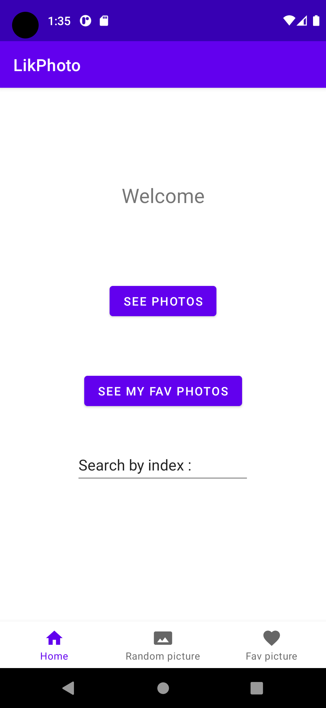
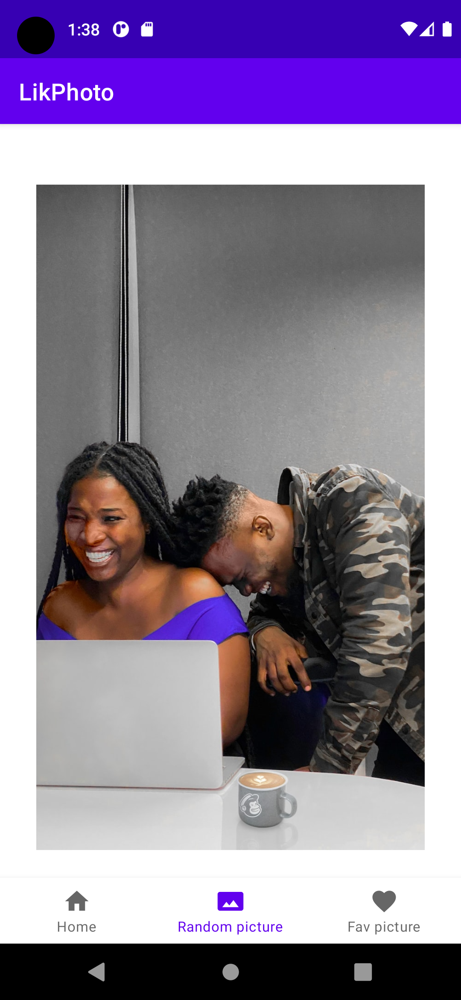
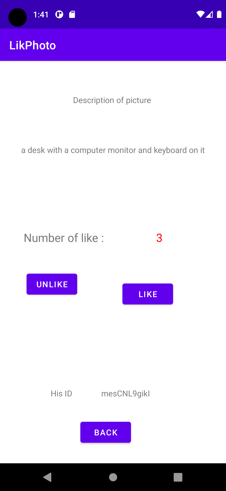
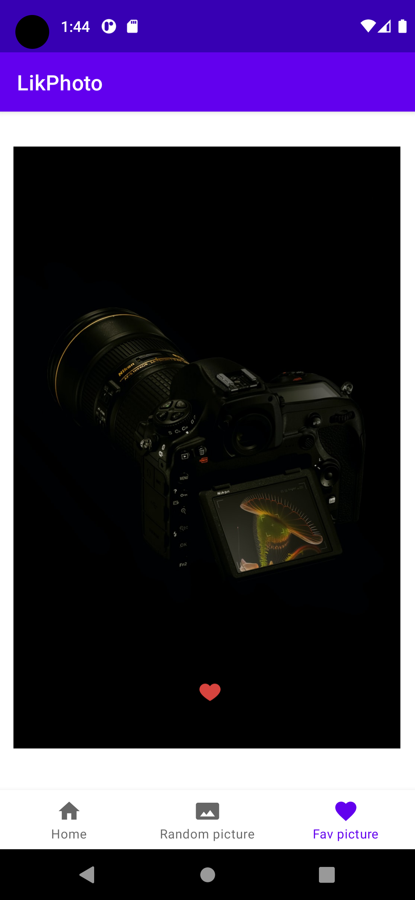

# :camera_flash: LikPhoto - A simple photo gallery app for Android devices build with Kotlin
> Images are provided by [Unsplash](https://unsplash.com/)
## Features

- [x] Display photos  
- [x] Display photo details
  - The details screen contains the photo's description, the number of like and a button to like or unlike the photo
    - when i click on the like button, the photo is added to the liked photos (the counter is incremented)
    - when i click on the unlike button, the photo is removed from the liked photos (the counter is decremented)
- [x] Search photos by keyword
  - I used the search endpoint of the API directly and displayed it on the random photos screen
- [x] Display liked photos
  - i used the room database to store the liked photos
  - When i click on the heart icon, the photo is removed from my liked photos & database
- [x] Cache photos
  - i used the room database to store the liked photos
    - when i unlike a photo from random photos screen if the photo is in the liked photos, it's removed from the liked photos screen
- [x] Clear cache
  - When i start the app, the cache is cleared (with const val CACHE_SIZE = 0) ref commit:a3c5bd1 (on MainActivity.kt)

The endpoints used are :
- [Get a list of photos](https://unsplash.com/documentation#list-photos)
- [Like a photo](https://unsplash.com/documentation#like-a-photo)
- [Unlike a photo](https://unsplash.com/documentation#unlike-a-photo)
- [Search photos](https://unsplash.com/documentation#search-photos)

## Architecture

- MVVM
- Repository pattern

## Libraries

| Plugin | Link |
| ------ |------|
| Retrofit | https://square.github.io/retrofit/ |
| Glide | https://bumptech.github.io/glide/ |
| Room | https://developer.android.com/topic/libraries/architecture/room |
| Kotlin Coroutines | https://kotlinlang.org/docs/reference/coroutines-overview.html |
| Xplosion | https://github.com/BanDev/Xplosion |
| Coil | https://coil-kt.github.io/coil/ |

## Screenshots

This is the home screen of the app.
The user can :
- Search photos by keyword
- Display liked photos by clicking on the `See my fav photos` button
- Display photos by clicking on the `See photos` button

This is the screen where the user can see the photos.

This is the screen where the user can see the details of a photo.
The screen contains the photo's description, the number of like and a button to like or unlike the photo.

This is the screen where the user can see the liked photos.

## :warning: Issues reporting

I have encountered errors :
- when i try to like or get a photos, i receive a 403 error => i have reached the limit of 50 likes per hour
- Sometimes i have to restart android studio to make the app work again (the AVD is not working)
- I modified my Room database to add new columns but received an error.To fix this, I had to change the version of the database to 2.

## Authors

* **Alexandre LORNE** - *Initial work*
